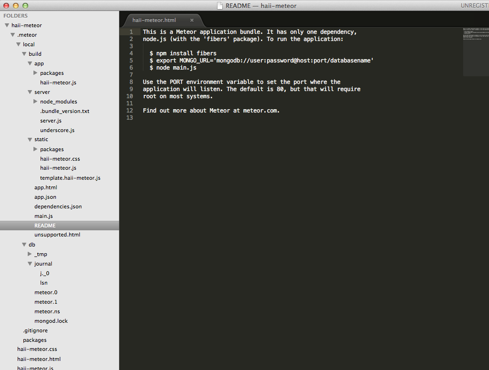
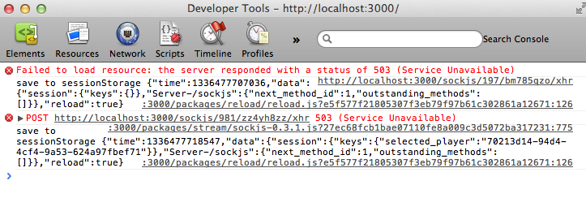
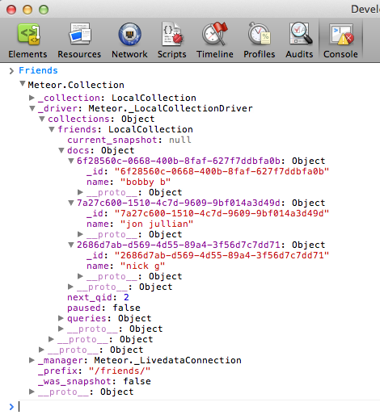
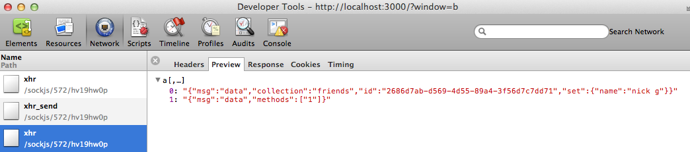
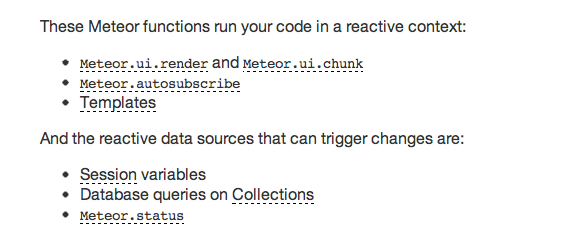
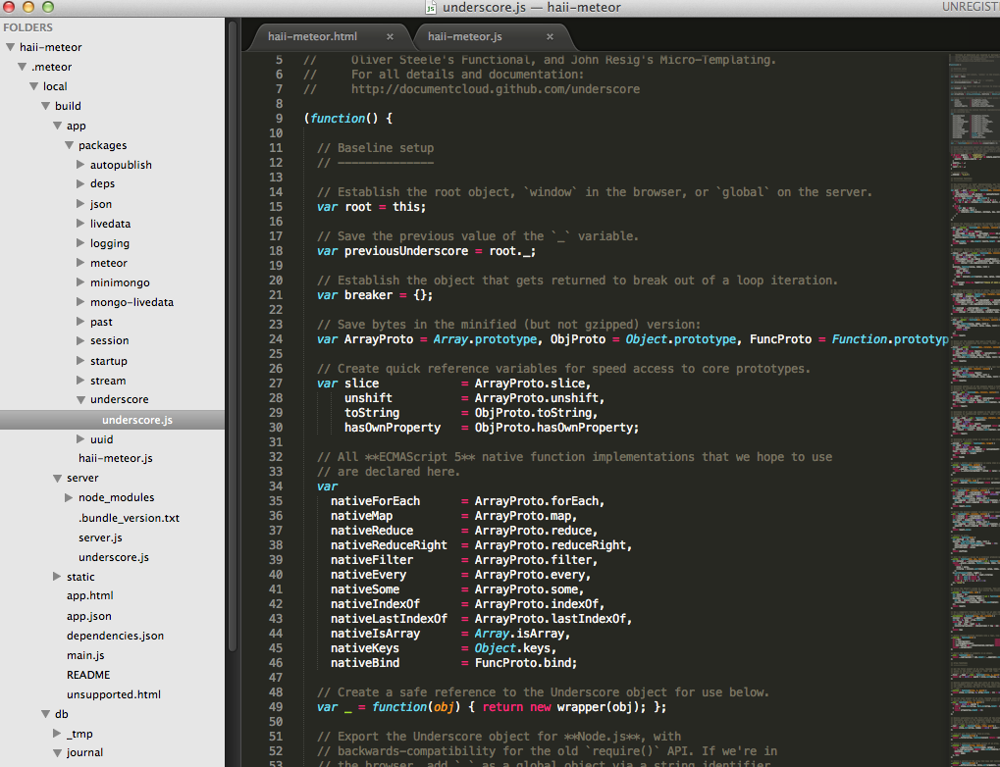

!SLIDE
# Well how does that work?
 * file-watcher with live refresh (live updating pages)
 * mongo commands on the client side
 * data-linked ui
 * wacky packages

!SLIDE fullscreen middle

!SLIDE

# live refresh
 1. long poll (25s)
 1. on file change, meteor returns `503`
 1. state saved to `sessionStorage`. access Session.keys
 1. browser causes refresh & state restored from sessionStorage

!SLIDE

# mongo commands
## client side proxy

!SLIDE

# mongo commands
##rpc over the wire
##echoed to each client

!SLIDE
# data-link ui
## reactive programming

!SLIDE

# data-link ui

!SLIDE

# wacky packages

!SLIDE
# wacky packages
## same code, decoupled from common.js `require` and available on both client and server

!SLIDE

